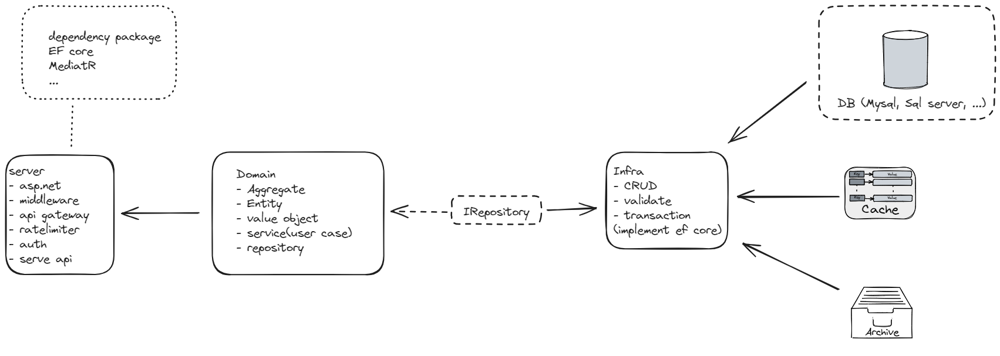

# Demo: inventory management system

## Template



## CLI

### init project

Command: 

    make init_project

Folder structure:  
server/ is application layer in DDD.  
domain/  
infra/ 

```
dotnet new webapi -o server
```
```
dotnet new classlib -o domain
```
```
dotnet new classlib -o infra
```

### add project to solution


## Business

- import/export goods into/from warehouse
- tracking
- report

## System Design

[System design](./docs/system_design.md)

### Domain

#### Entity

1. goods_stock
2. position
3. warehouse

#### Value Object

- goods_note

#### Aggregate

- **goods_stock**  
    - have many goods_note  
    - in a position/warehouse
    - import/export by goods_note
    - change position/warehouse
- **warehouse**
    - generate report
    - have many goods_stock/position

#### Service - use case

- report by specific goods/position/user
- tracking history

#### Repository: Interface

- validate and map model to aggregate/entity
- execute store data to infra
- get and map data for domain

### Infra

- implemnt repository interface
- database: postgresql
- cache: in-menmory, (or redis)
- package: EF core, AutoMapper
- export class DbContext

### Application

- asp.net core minimal api
- package: MediatR, EF core
- DI domain, infra
- migrate database
- cli tools
