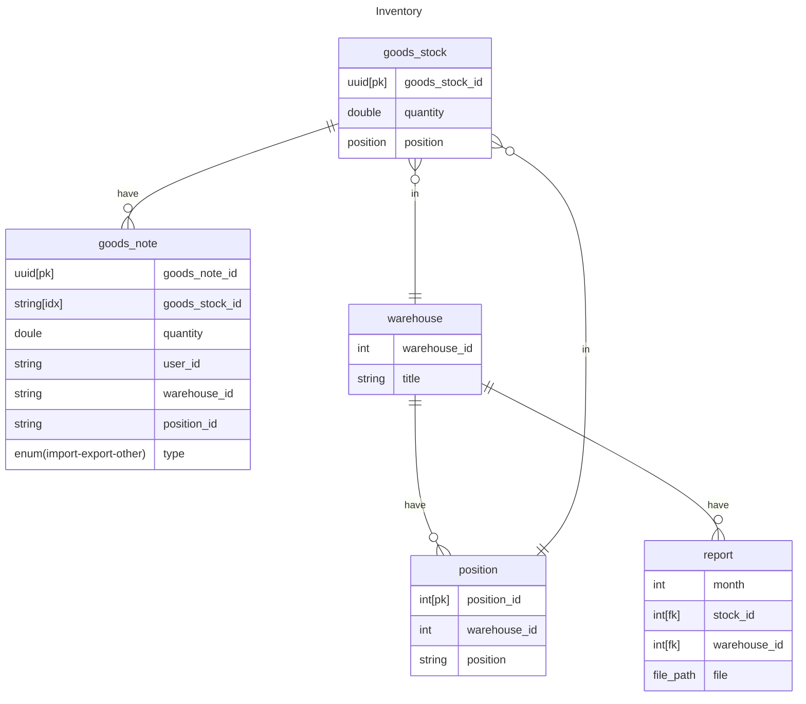
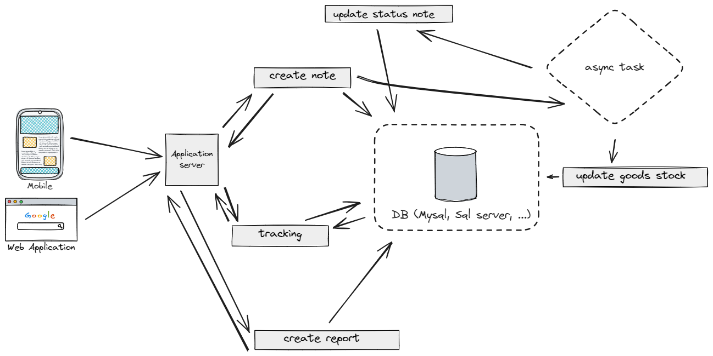

# Sytem design

## 1. Clarify requirement

### Functionnal requirement

- import goods into warehouse
- export goods from warehouse
- tracking position of goods
- tracking history:
    - import, export on goods_stock
- report

### None-functional requirement

- conisten data
- latency:
    - normal query: < 1s
    - action: < 5s
    - report: < 30

## 2. Back envolop estimate

Daily active user: <100  
RPS (request per second): 20  
Read:Write ~ 5:1  

- report: ~5mb per day for 1 warehouse  
- record import/export: 5byte/record

storage per year:  
    - report: 5mb x 30 x 365 ~ 10GB
    - record: 5byte x 2 x 30 x 365 ~ 10byte x 10^4 ~ 100MB

## 3. API design

- import goods into warehouse: import(api_dev_key, goods_info, position, warehouse, quantity, by_user) return (Ok | Fail)
- export goods into warehouse: import(api_dev_key, goods_info, position, warehouse, quantity, by_user) return (OK | Fail)
- tracking position: getPosition(api_dev_key, good_stock_id, warehouse) return position_info
- tracking history:  getHistory(api_dev_key, good_stock_id)

## 4. Model design

## 5. Highlevel design

## 6. Detail design